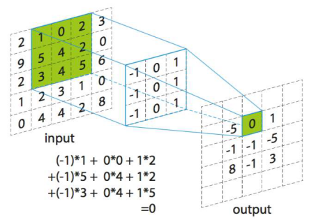

# Lab5: 图像卷积性能优化

!!! warning "Deadline"

    2026年5月8日23:59

## 1. 实验背景
图像卷积是计算机视觉与人工智能中的基础计算。本实验要求你在保证结果正确的前提下，优化 C 语言卷积实现，理解缓存局部性、分支预测与循环开销对性能的影响。

### 1.1 卷积是什么？

从宏观来看，**卷积（Convolution）** 是一种通过周围邻域信息来改变当前像素值的运算。它通过一个小的矩阵（卷积核）对输入图像进行滑动窗口操作，生成一个新的输出图像。

#### 核心组成：
1.  **输入图像**：灰度图像是一个 $N \times N$ 的数字矩阵（像素值 $0-255$，本实验中为 `float`）。
2.  **卷积核/算子 (Kernel/Filter)**：一个小的数字矩阵（通常是$3 \times 3$ 或 $5 \times 5$），它定义了如何“改变”像素。
3.  **输出图像**：卷积运算后的结果。

### 1.2 卷积怎么算？

计算过程遵循 **“相乘并累加”** 的原则。

#### 步骤详解：
假设你有一个$3 \times 3$的卷积核，要计算坐标为$(i, j) $的输出像素：

1.  **放置**：将卷积核的**中心点**对准输入图像的$(i, j) $像素。
2.  **点乘**：将卷积核覆盖到的所有像素点，与卷积核对应位置的权重逐一相乘。
3.  **累加**：将这 9 个乘积相加，得到的结果就是输出图像在$(i, j) $处的值。
4.  **滑动**：向右或下移动一个单位，重复上述过程，直到覆盖全图。



#### 边界处理：Zero Padding
当卷积核对齐到图像边缘时，一部分核会落在图像外面。本实验使用 **Zero Padding**：假设图像边界以外的所有值都是 **0**。这保证了输出图像的尺寸与输入图像完全一致。(当然，实际应用中还有其他边界处理方法。)


## 2. 实验任务
你需要实现并优化函数：

```c
void convolution(int n, float *src, float *kernel, float *dst);
```

其中：
- `src`：输入灰度图，尺寸 `n x n`，按行连续存储。
- `kernel`：卷积核，固定为 `5 x 5`，按行连续存储。
- `dst`：输出图像，尺寸 `n x n`。


## 3. 性能评价
加速比定义为：

$$
Speedup_{total} = \left( \prod_{i=1}^{m} \frac{TPE_{baseline, i}}{TPE_{optimized, i}} \right)^{\frac{1}{m}}
$$
其中 **TPE (Time Per Element)** 为处理单个像素的平均纳秒数$(TPE = \frac{T}{N^2})$。通过对比不同尺度下的 TPE，你可以观察到性能的变化。

性能基于$N \in \{512, 1024, 2048, 4096, 8192\}$五个尺度下的几何平均加速比。

正确性：结果需与 `baseline_convolution` 一致（允许微小浮点误差）。

## 4. 代码结构

本次实验已提供好实验代码框架，[点此下载](https://ustc-isp.github.io/lab/lab5/lab5.zip)

- `main.c`：评测驱动（正确性 + 性能）
- `convolution.c`：你主要修改的文件
- `convolution.h`：接口定义

## 5. 运行方式

编译并测试（每个测试只跑一轮）：

```bash
make test
```

测试正确输出示例：

```bash
ubuntu@VM12692-my:~/Desktop/conv$ make test
cc -std=c11 -Wall -Wextra -pedantic -O2 main.c convolution.c -o lab5 -lm
./lab5 1 1
=== Performance Benchmark (Geometric Mean) ===
Kernel size: 5 x 5
Rounds per size: 1

Max absolute error: 2.384186e-07
N= 512 | TPE_Base:  86.68 ns | TPE_Opt:  12.21 ns | Speedup:  7.10x
Max absolute error: 2.980232e-07
N=1024 | TPE_Base:  94.10 ns | TPE_Opt:  13.80 ns | Speedup:  6.82x
Max absolute error: 2.980232e-07
N=2048 | TPE_Base: 105.35 ns | TPE_Opt:  12.56 ns | Speedup:  8.39x
Max absolute error: 2.980232e-07
N=4096 | TPE_Base: 212.96 ns | TPE_Opt:  16.12 ns | Speedup: 13.21x
Max absolute error: 3.576279e-07
N=8192 | TPE_Base: 175.20 ns | TPE_Opt:  15.83 ns | Speedup: 11.07x

Overall Speedup (Geometric Mean): 9.009x
```

性能评测（每个测试跑5轮）：

```bash
make perf
```

测试正确输出示例：

```bash
ubuntu@VM12692-my:~/Desktop/conv$ make perf
./lab5 5 1
=== Performance Benchmark (Geometric Mean) ===
Kernel size: 5 x 5
Rounds per size: 5

Max absolute error: 2.384186e-07
N= 512 | TPE_Base:  74.03 ns | TPE_Opt:  11.70 ns | Speedup:  6.33x
Max absolute error: 2.980232e-07
N=1024 | TPE_Base:  84.68 ns | TPE_Opt:  13.13 ns | Speedup:  6.45x
Max absolute error: 2.980232e-07
N=2048 | TPE_Base: 107.61 ns | TPE_Opt:  12.81 ns | Speedup:  8.40x
Max absolute error: 2.980232e-07
N=4096 | TPE_Base: 144.29 ns | TPE_Opt:  15.91 ns | Speedup:  9.07x
Max absolute error: 3.576279e-07
N=8192 | TPE_Base: 182.34 ns | TPE_Opt:  15.59 ns | Speedup: 11.70x

Overall Speedup (Geometric Mean): 8.168x
```

自定义输入：

```bash
./lab5 [rounds] [seed]
```

- `rounds`参数代表测试轮数，整数，默认为10
- `seed`参数代表随机种子数，整数，不同种子数生成的图像不同

## 6. 提交方式

请根据题目要求，在实验框架中完成相应的代码，并提交实验报告或说明文档，详细描述你的优化思路、关键实现和测试结果。

建议对优化方法逐个实现并测试效果，按照以下结构整理你的代码和报告，提交压缩包：

```
姓名-学号/
├── convolution_v1.c     // 卷积性能优化代码版本1
├── convolution_v2.c     // 卷积性能优化代码版本2
├── convolution_v3.c     // 卷积性能优化代码版本3
├── convolution...    
├── convolution_final.c  // 所有优化汇总版本
└── 姓名-学号.pdf      // 实验报告（包含优化思路、实现细节、性能测试结果等）
```

提交至希冀平台。

## 7. 评分标准

本次实验总分10 分，分为程序正确性（6 分）和性能优化（4 分） 两部分，评分细则如下：

### 7.1 程序正确性（6 分）

- 代码可正常编译运行，无编译错误、无运行崩溃；
- 卷积计算结果正确，与基准实现输出一致，无数值错误。

### 7.2 性能优化（4 分）

- 优化项每实现一个有效优化并在报告中说明，得1 分；

- 实现**3** 个及以上有效优化，优化部分得满分 4 分。


<!-- 强制分页 --> <div style="page-break-after: always;"></div>

# 实验指导：程序性能优化方法

## 1. 算法层优化

在考虑 CPU 指令和缓存细节之前，先选择正确的**数据结构**和**算法**。一个好的算法设计往往能带来数倍甚至数十倍的性能提升。

更高级的算法会在《数据结构》与《算法基础》课程中系统讲解，本课程中不作要求。

## 2. 系统层优化

除了算法层面的优化，理解并利用现代计算机体系结构特性也是提升性能的关键。

当 CPU 执行一段代码时，它同时受到三个方面的限制：

1. **数据依赖**：如果指令 B 需要指令 A 的计算结果，B 必须等 A 完成
2. **资源约束**：CPU 的执行单元数量有限（例如只有 2 个浮点乘法器）
3. **内存访问**：访问内存远比访问寄存器慢（延迟可能相差几个数量级）

理解这三点，就能理解为什么有些优化方法有效。

### 2.1 消除循环中的重复计算

在循环的每次迭代中，某些计算的结果都**完全相同**（不依赖于迭代变量），显然，重复计算会浪费 CPU 周期。将这些不变的计算提取到循环外部，可以提升性能。

#### 案例分析
考虑以下求和代码：
```c
int sum(int a[]) {
    int s = 0;
    for (int i = 0; i < length(a); i++) { // 每次都会调用 length()
        s += a[i];
    }
    return s;
}
```
由于数组 `a` 的长度在循环中是固定不变的，每次迭代都调用 `length(a)`（如果是字符串 `strlen` 更是 $O(n)$ 复杂度）会造成严重的性能浪费。

#### 优化方案
```c
int sum(int a[]) {
    int s = 0;
    int len = length(a); // 提前提取到循环外
    for (int i = 0; i < len; i++) {
        s += a[i];
    }
    return s;
}
```

> 在lab5卷积操作中，卷积核的大小`K_SIZE`和偏移量`K_RADIUS`应当在最外层计算好，不要在最内层像素点计算时重复执行加减法逻辑。


### 2.2 寄存器变量

内存访问（Load/Store）比寄存器操作慢得多。尽量使用局部变量暂存累加结果。

#### 案例分析
```c
void mult(int a[], int *dst) {
    int len = length(a);
    for (int i = 0; i < len; i++) {
        *dst = *dst * a[i]; // 每次迭代都要读写一次内存
    }
}
```
CPU 无法确定指针 `dst` 是否可能指向数组 `a` 中的某个元素（内存别名风险），因此每次都会老老实实地从内存读出 `*dst`，计算后再写回内存。

#### 优化方案
通过引入局部变量（通常会被分配至寄存器）暂存中间计算结果。
```c
void mult(int a[], int *dst) {
    int len = length(a);
    int temp = *dst; // 暂存到寄存器
    for (int i = 0; i < len; i++) {
        temp = temp * a[i];
    }
    *dst = temp; // 最终写回
}
```

lab5中，在计算某个像素的卷积和时，使用一个 `float sum = 0.0f;` 局部变量累加，等 Kernel 的乘法全部完成后，再把结果写回 `dst[i*n + j]`。


### 2.3 循环展开与指令级并行

**核心思想**：通过增加单次迭代中计算元素的数量，减少循环控制开销（索引自增、条件判断）。

#### 硬件机制

现代 CPU 不是一条一条指令地执行，而是**同时处理多条指令**（例如一条在 ALU，一条在浮点乘法器，一条在 Load/Store 单元）
如果后续指令依赖于前一条指令的结果，CPU 必须停工等待（称为"停顿"），如果不依赖则可以同时发射多条指令。

#### 案例分析

```c
float result = 1.0f;
for (int i = 0; i < 1000; i++) {
    result = result * array[i];  // 有数据依赖
}
```

执行时序：
```
周期 0：乘法指令 1 发射（延迟 3-5 个周期）
周期 1-2：CPU 空闲，等待指令 1 的结果
周期 3-4：CPU 空闲，等待指令 1 的结果
周期 5：乘法指令 2 发射
周期 6-8：CPU 空闲，等待指令 2 的结果
...
```

浪费了大量 CPU 周期。

#### 解决方案：循环展开与多个累加器

示例：

```c
// 展开因子为 4（处理 4 个独立的累加）
float result1 = 1.0f, result2 = 1.0f, result3 = 1.0f, result4 = 1.0f;
for (int i = 0; i < 1000; i += 4) {
    result1 = result1 * array[i];
    result2 = result2 * array[i+1];  // ✓ 不依赖于 result1
    result3 = result3 * array[i+2];  // ✓ 不依赖于 result1
    result4 = result4 * array[i+3];  // ✓ 不依赖于 result1
}
float result = result1 * result2 * result3 * result4;
```

执行时序：
```
周期 0：乘法指令 1（结果1） 发射
周期 1：乘法指令 2（结果2） 发射
周期 2：乘法指令 3（结果3） 发射
周期 3：乘法指令 4（结果4） 发射
周期 4-5：CPU 继续处理其他指令或缓存
周期 6：结果1 准备好，开始处理下一组指令
...
```

4 条不相关的指令可以**并发执行**。

#### 编译器的自动展开

现代编译器（如 `-O3` 优化等级）会**自动尝试展开循环**。但对于固定的小循环（如$ (3 \times 3)$ 卷积），手动展开往往更清晰，也能确保编译器按你的意图行动。

### 2.4 内存层级结构与分块技术

lab5的图像处理操作是典型的**内存密集型** 计算任务 。优化此类程序的关键不在于减少算术运算，而在于如何高效地调度数据在**存储器层级结构** 中的流动，最大化**缓存命中率** 。

#### 存储器层级结构
| 层级        | 访问延迟  | 容量   |
| ----------- | --------- | ------ |
| 寄存器      | ~1 纳秒   | 几十个 |
| L1 Cache    | ~4 纳秒   | 32 KB  |
| L2 Cache    | ~12 纳秒  | 256 KB |
| L3 Cache    | ~40 纳秒  | 8 MB   |
| 主内存 DRAM | ~100 纳秒 | 16 GB  |
| 磁盘存储    | ~毫秒级   | TB 级  |

越往上速度越快，容量越小，而我们优化让尽可能多的数据访问命中 L1 Cache，避免 DRAM 访问。


#### 缓存行与访存步长

硬件层面的数据交换并非以字节为单位，而是以**缓存行 (Cache Line)** 为基本单位（在现代处理器上通常为 **64-byte**）。

当 CPU 访问地址`float *A` 时：
1. 硬件判断 A 属于哪条缓存行（比如缓存行 k）
2. **自动将整条缓存行 k 加载到 L1 Cache**（包含 16 个 float）
3. 之后的 15 次访问（A+1, A+2, ..., A+15）直接命中 L1（无延迟）

然而，在大步长访问时（例如按列访问），每次访问都会产生一次**缓存失效**，迫使 CPU 停工等待内存控制器从高延迟的 DRAM 中搬运数据。

##### 案例分析：

```c
// 按列访问：内存地址不连续，步长很大
for (j = 0; j < 1024; j++) {
    for (i = 0; i < 1024; i++) {
        matrix[i][j] = i*j; // 每次访问的地址都间隔 1024*4=4096 字节，远大于64字节的缓存行
    }
}
```
+ 第一次访问`matrix[0][j]`：加载一条缓存行到 L1。
+ 下一次访问`matrix[1][j]`：地址和上一次差了 4096 字节，根本不在刚才加载的缓存行里，又要去主存加载新的缓存行。
+ 结果：每次访问都要访问主存，CPU 只能停工等待，性能显著降低。

##### 优化方案

```c
// 按行访问：内存地址连续，高缓存命中率
float matrix[1024][1024];
int i, j;
for (i = 0; i < 1024; i++) {
    for (j = 0; j < 1024; j++) {
        matrix[i][j] = 0; 
        // 连续访问：matrix[i][0], matrix[i][1], ..., matrix[i][15]在同一条缓存行
    }
}
```
+ 第一次访问`matrix[i][0]`：CPU 发现这条缓存行不在 L1 Cache，于是从主存把包含它的 64 字节（16 个 float）一次性加载到 L1。
+ 接下来访问`matrix[i][1]` 到`matrix[i][15]`：全部命中 L1 Cache，不需要访问主存，几乎没有延迟。

#### 分块技术

当图像维度$ N$较大（如 $N \ge 1024$）时，由于单行数据量可能已超过 L1/L2 Cache 的容量，传统的线性扫描仍会导致缓存行在被重用前就被踢出。**分块** 是一种针对性技术，旨在将大矩阵划分为子块，使每个小块的数据能完全驻留在缓存中 。

##### 案例分析 

```c
// 未分块的矩阵赋值
void matrix_assign(float A[N][N]) {
    for (int i = 0; i < N; i++) {
        for (int j = 0; j < N; j++) {
            A[i][j] = i * j;  
        }
    }
}
```

- 当 $N=1024$ 时，`A` 矩阵一行有 1024 个 float（4KB），L1 Cache 装不下一整行，数据会频繁被替换。

##### 优化方案


```c
// 分块优化的矩阵赋值
#define BLOCK_SIZE 32
void matrix_assign_blocked(float A[N][N]) {
    for (int i_blk = 0; i_blk < N; i_blk += BLOCK_SIZE) {
        for (int j_blk = 0; j_blk < N; j_blk += BLOCK_SIZE) {
            // 仅处理当前 32×32 的子块
            for (int i = i_blk; i < i_blk + BLOCK_SIZE; i++) {
                for (int j = j_blk; j < j_blk + BLOCK_SIZE; j++) {
                    A[i][j] = i * j;
                }
            }
        }
    }
}
```

- 每次只处理 `BLOCK_SIZE x BLOCK_SIZE`大小的子块（比如 $32 \times 32 = 1024$ 个 float，仅 4KB），这个大小的块可以完整放在 L1 Cache 里。
- 处理当前块时，数据被反复访问都能命中缓存，不需频繁访问主存。


### 2.5 分支消除

现代处理器的流水线执行高度依赖分支预测器。一旦预测失败，处理器必须丢弃已进入流水线的后续指令，代价极高。我们需尽量减少热点代码中的条件分支，尤其是那些方向不确定的分支。

**lab5应用**：

+ 在卷积最内层循环中实施边界检查 `if (row >= 0 && row < n ...)` 会引入大量方向不确定的条件分支，严重干扰指令预取与执行。
+ 优化方案：通过在原始图像外围填充一层宽度等于卷积半径的空白区域，可以将复杂的边界处理逻辑从热点路径中剥离。将计算核心转化为无分支的线性代码流。

```shell
原始图像：         
┌-------┐
│ · · · │
│ · · · │
│ · · · │
└-------┘ 
填充后：
┌-----------┐
│ 0 0 0 0 0 │
│ 0 · · · 0 │
│ 0 · · · 0 │
│ 0 · · · 0 │
│ 0 0 0 0 0 │
└-----------┘ 
```

在填充后的图像上进行卷积计算时，内层循环不再需要边界检查，消除了所有条件分支（以及由此引起的分支预测失败），提升性能。


